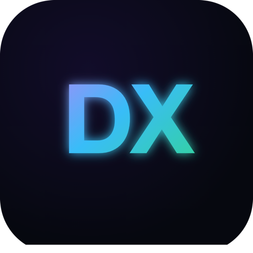

<div align="center">



# Halo

### 7×24 小時桌面 AI Agent，人人可用


7×24 小時指揮你的電腦，驅動 AI 瀏覽器自主完成任務，同時擁有友好的可視化介面與完整的檔案管理能力。

寫程式碼、寫 PPT、做調查、寫報告、部署伺服器、整理桌面、操控瀏覽器……凡是 Agent 能力所及，一概支援。開源且免費。

> **我們的理念：** 將複雜技術封裝成符合直覺的人類互動。

[](https://github.com/openkursar/hello-halo/stargazers)
[](../LICENSE)
[](#安裝)
[](https://github.com/openkursar/hello-halo/releases)

[下載](#安裝) · [文件](#文件) · [參與貢獻](#參與貢獻)

**[简体中文](../README.md)** | **[English](./README.en.md)** | **[Español](./README.es.md)** | **[Deutsch](./README.de.md)** | **[Français](./README.fr.md)** | **[日本語](./README.ja.md)**

</div>

---

<div align="center">


</div>

---

## 為什麼選擇 Halo？

Halo 由 Claude Code 驅動，擁有與其同等強大的 Agent 能力。

不同的是，Halo 將這份能力帶出了終端機 — 給它一個可視化的家，一個隨時待命的介面，以及一套可以在背景 7×24 小時自主運轉的數位人體系。

你不需要懂命令列，不需要設定環境，不需要盯著螢幕等待。下載、安裝、執行，然後告訴它你想做什麼。

---

## 功能特性

<table>
<tr>
<td width="50%">

### 真正的 Agent 迴圈
不只是聊天。Halo 能**真正做事** — 寫程式碼、建立檔案、執行命令，持續迭代直到任務完成。

### 空間系統
隔離的工作空間讓你的專案井井有條。每個空間都有獨立的檔案、對話和上下文。

### 優雅的產物欄
即時查看 AI 建立的每個檔案。預覽程式碼、HTML、圖片 — 無需離開應用程式。

</td>
<td width="50%">

### 遠端存取
從手機或任何瀏覽器控制你的桌面 Halo。隨時隨地工作 — 甚至在醫院病床上（真實故事）。

### AI 瀏覽器
讓 AI 控制真實的內嵌瀏覽器。網頁擷取、表單填寫、測試 — 全部自動化。

### MCP 支援
透過 Model Context Protocol 擴展能力。相容 Claude Desktop MCP 伺服器。

</td>
</tr>
</table>

### 更多特性...

- **Skills 技能** — 為 Agent 安裝專屬技能包，擴展任務邊界
- **多供應商支援** — Anthropic、OpenAI、DeepSeek，以及任何 OpenAI 相容 API
- **即時思考過程** — 觀看 AI 的思考過程
- **工具權限控制** — 批准或自動允許檔案/命令操作
- **深色/淺色主題** — 跟隨系統主題
- **多語言支援** — 英文、中文、西班牙語等
- **自動更新** — 一鍵保持最新

---

## 數位人

數位人是在背景自主為你工作的 AI Agent — 持續監控、定時彙總、主動通知，無需你手動觸發。

在 **Halo 數位人商店**中一鍵安裝，無需設定，即刻運行。

> 把它想像成手機上的 App，差別是：它們主動為你工作。

### 使用者 — 幾秒鐘完成安裝

打開商店，選擇數位人，填寫幾個設定項，它就開始運行了。無需寫程式碼，無需撰寫提示詞。

數位人能為你做什麼：

- 監控商品價格，降價時立即提醒你
- 每天早晨推送新聞或市場摘要
- 監控你的收件匣，摘要出真正重要的內容
- 追蹤你的品牌或產品的社群提及
- 定時生成報告並傳送給團隊

### 開發者 — 建構並發布

想為生態貢獻數位人？撰寫一個 `spec.yaml`，向 [數位人協議 (DHP)](https://github.com/openkursar/digital-human-protocol) 倉庫提交 PR — 這是 Halo 數位人商店背後的開源協議。

合併後，你的 Agent 立即對所有 Halo 使用者可用。

---

## 截圖


*遠端存取：從任何地方控制 Halo*


<p align="center">
  
  &nbsp;&nbsp;
  
</p>

AI 瀏覽器視頻演示

https://github.com/user-attachments/assets/2d4d2f3e-d27c-44b0-8f1d-9059c8372003

---

## 更多功能演示

[](https://www.bilibili.com/video/BV1jEZYBaEcy/)

---

## 安裝

### 下載（推薦）

| 平台 | 下載 | 要求 |
|----------|----------|--------------|
| **macOS** (Apple Silicon) | [下載 .dmg](https://github.com/openkursar/hello-halo/releases/latest) | macOS 11+ |
| **macOS** (Intel) | [下載 .dmg](https://github.com/openkursar/hello-halo/releases/latest) | macOS 11+ |
| **Windows** | [下載 .exe](https://github.com/openkursar/hello-halo/releases/latest) | Windows 10+ |
| **Linux** | [下載 .AppImage](https://github.com/openkursar/hello-halo/releases/latest) | Ubuntu 20.04+ |
| **Web** (PC/行動端) | 在桌面應用程式中啟用遠端存取 | 任何現代瀏覽器 |

**就這麼簡單。** 下載、安裝、執行。不需要 Node.js，不需要 npm，不需要終端命令。

### 從原始碼建置

想要貢獻或自訂的開發者：

```bash
git clone https://github.com/openkursar/hello-halo.git
cd hello-halo
npm install
npm run prepare        # 下載當前平台的二進位依賴
npm run dev
```

---

## 快速開始

1. **啟動 Halo** 並輸入你的 API 金鑰（推薦 Anthropic）
2. **開始聊天** — 試試「用 React 建立一個簡單的待辦事項應用程式」
3. **見證魔法** — 看著檔案在產物欄中出現
4. **預覽和迭代** — 點擊任何檔案預覽，要求修改

> **小技巧:** 為獲得最佳效果，使用 Claude Sonnet 4.5 或 Opus 4.5 模型。

---

## 運作原理

```
┌─────────────────────────────────────────────────────────────────┐
│                          Halo 桌面端                             │
│  ┌─────────────┐    ┌─────────────┐    ┌───────────────────┐   │
│  │   React UI  │◄──►│    主程序    │◄──►│  Claude Code SDK  │   │
│  │  (渲染程序)  │IPC │   (Main)    │    │   (Agent 迴圈)    │   │
│  └─────────────┘    └─────────────┘    └───────────────────┘   │
│                            │                                    │
│                            ▼                                    │
│                    ┌───────────────┐                           │
│                    │   本機檔案     │                           │
│                    │   ~/.halo/    │                           │
│                    └───────────────┘                           │
└─────────────────────────────────────────────────────────────────┘
```

- **100% 本機** — 你的資料永遠不會離開你的電腦（除了 API 呼叫）
- **無需後端** — 純桌面用戶端，使用你自己的 API 金鑰
- **真正的 Agent 迴圈** — 工具執行，而不只是文字生成

> **由 [Claude Code](https://github.com/anthropics/claude-code) 驅動** — 感謝 Anthropic 打造最強大的 AI Agent。

---

## 使用者在用 Halo 做什麼

Halo 不只是給開發者用的。我們看到：

- **金融團隊** 從零開始建構全端應用程式 — 完全沒有程式設計經驗
- **內容創作者** 用 AI 自動調查、撰寫、整理資料，一氣呵成
- **營運人員** 讓數位人每天定時生成報告、監控競品、彙總輿情
- **設計師** 製作互動原型，快速驗證創意
- **學生** 以 AI 作為程式設計夥伴，邊做邊學
- **開發者** 用 AI 瀏覽器自動化測試、擷取資料、部署伺服器

障礙不再是 AI 的能力，**而是可及性**。Halo 消除了這個障礙。

---

## 路線圖

- [x] 基於 Claude Code SDK 的核心 Agent 迴圈
- [x] 空間與對話管理
- [x] 產物預覽（程式碼、HTML、圖片、Markdown）
- [x] 遠端存取（瀏覽器控制）
- [x] AI 瀏覽器（基於 CDP）
- [x] MCP 伺服器支援
- [x] Skills 技能系統
- [x] 數位人與數位人商店
- [ ] 外掛系統
- [ ] Git 視覺化與 AI 輔助程式碼審查
- [ ] AI 智慧檔案搜尋

---

## 參與貢獻

Halo 開源是因為 AI 應該人人可及。

我們歡迎各種貢獻：

- **翻譯** — 幫助我們觸達更多使用者（見 `src/renderer/i18n/`）
- **Bug 報告** — 發現問題？告訴我們
- **功能建議** — 什麼能讓 Halo 更好用？
- **程式碼貢獻** — 歡迎 PR！

```bash
# 開發環境設定
git clone https://github.com/openkursar/hello-halo.git
cd hello-halo
npm install
npm run prepare        # 下載當前平台的二進位依賴
npm run dev
```

查看 [CONTRIBUTING.md](../CONTRIBUTING.md) 了解詳細指南。

---

## 社群

- [GitHub Discussions](https://github.com/openkursar/hello-halo/discussions) — 問題與想法
- [Issues](https://github.com/openkursar/hello-halo/issues) — Bug 報告與功能請求

---

## 授權條款

MIT 授權條款 — 詳見 [LICENSE](../LICENSE)。

---

## 受到 Halo 的啟發？

如果本專案給了你靈感，或幫你建構了很酷的東西：

- **給我們一個 Star** — 幫助更多人發現 Halo
- **分享你的故事** — 我們很想知道你做了什麼
- **提及我們** — 例如 `Inspired by [Halo](https://github.com/openkursar/hello-halo)`

---

## Halo 背後的故事

幾個月前，一切始於一個簡單的困擾：**我想用 Claude Code，但整天都在開會。**

在無聊的會議中（我們都經歷過），我想：*如果我能從手機控制家裡電腦上的 Claude Code 呢？*

然後又遇到另一個問題 — 我的非技術同事看到 Claude Code 能做什麼後也想試試。但他們卡在了安裝環節。*「什麼是 npm？怎麼安裝 Node.js？」* 有些人花了好幾天也沒搞定。

所以我為自己和朋友做了 Halo：
- **視覺化介面** — 不用再盯著終端輸出
- **一鍵安裝** — 不需要 Node.js，不需要 npm，下載即用
- **遠端存取** — 從手機、平板或任何瀏覽器控制

第一版只用了幾個小時。之後的所有功能？**100% 由 Halo 自己建構。** 我們已經日常使用好幾個月了。

AI 建構 AI。現在人人可用。

---

## 貢獻者

<a href="https://github.com/openkursar/hello-halo/graphs/contributors">
  
</a>

由我們的貢獻者用 ❤️ 打造。

<div align="center">

### 由 AI 建構，為人類服務。

如果 Halo 幫你創造了精彩的東西，我們很想聽聽。

**Star 這個儲存庫** 幫助更多人發現 Halo。

[](https://star-history.com/#openkursar/hello-halo&Date)

[⬆ 返回頂部](#halo)

</div>
